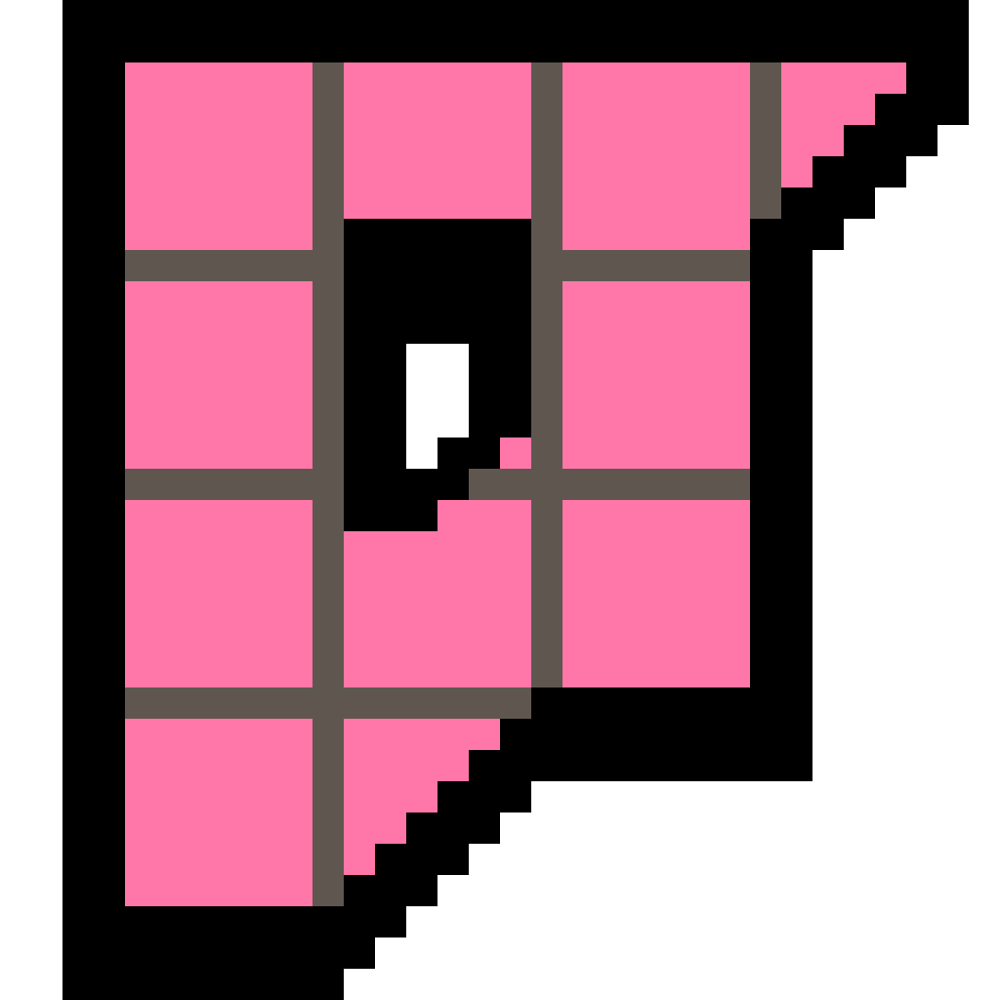
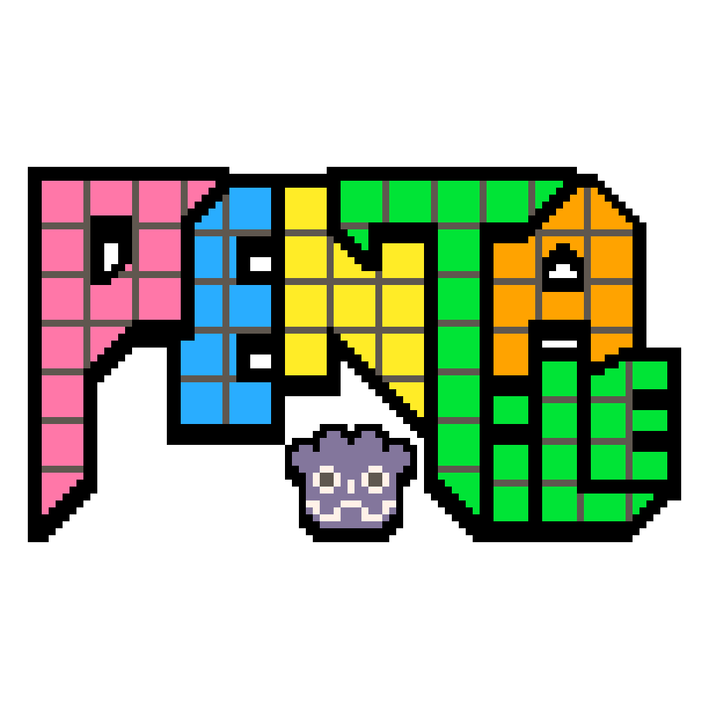

#  PentaTile

**Just paint your tiles.** Intuitive Godot autotiling addon that takes the pain out of tilesets, with no manual terrain setup needed. Supports [5-archetype **Penta**](#-what-is-a-penta-tileset) and [popular layouts](#-supported-layouts). Paint with Godot's normal tools and PentaTile fills in the corners, edges, and transitions for you.



## 📑 Table of Contents

1. [Why PentaTile?](#-why-pentatile)
2. [What is a Penta tileset?](#-what-is-a-penta-tileset)
3. [Supported Layouts](#-supported-layouts)
4. [The Penta-System Template](#-the-penta-system-template)
5. [Layouts](#-layouts)
6. [Comparison: PentaTile vs. TileMapDual](#-pentatile-vs-tilemapdual-api)
7. [Choosing the Right Tool](#-choosing-the-right-tool)
8. [Docs Site](#-docs-site)
9. [Addon Layout](#-addon-layout)
10. [Current API](#-current-api)
11. [Demo](#-demo)
12. [Authoring a Custom Layout](#-authoring-a-custom-layout)
13. [Upgrading from 0.1.x](#-upgrading-from-01x)
14. [Identity & Footprint](#-identity--footprint)
15. [Implementation Notes](#-implementation-notes)
16. [Roadmap](#-roadmap)
17. [Maintainer: create the addon split branch](#-maintainer-create-the-addon-split-branch)
18. [Using PentaTile as a subtree dependency](#-using-pentatile-as-a-subtree-dependency)
19. [VS Code task for updating without typing the CLI command](#-vs-code-task-for-updating-without-typing-the-cli-command)
20. [Dependencies](#-dependencies)
21. [External Resources](#-external-resources)

## 🚀 Why PentaTile?

- **Reduced Tile Requirements:** Creating 47 tiles for a single terrain type is a time-consuming task. PentaTile's signature **Penta** layout scales the requirement from as few as one tile up to five (the progressive ONE through FIVE modes), lowering the barrier for creating custom game art while maintaining professional results.
- **Efficient Visual Variation:** Authoring as few as 1–5 tiles per terrain makes iteration cheap. Instead of redrawing dozens of tiles for a single alternative set, you can quickly iterate on the small archetype set to add organic variety and reduce repetitive patterns.
- **Native Integration:** Built as a single-class subclass of `TileMapLayer`, PentaTile hooks directly into Godot's native API. It listens to standard drawing commands and updates the visual layers in real-time without requiring a custom drawing interface.

## 🍀 What is a Penta tileset?


A **Penta tileset** is a 5-archetype autotile format. The five archetypes, **listed in canonical slot order**:

1. **IsolatedCell** (slot 0) — a tile with all four edges and all four corners exposed; serves as the source for synthesizing OuterCorner.
2. **Fill** (slot 1) — a tile with all four edges adjacent to the same terrain; the most common interior tile.
3. **Border** (slot 2) — a tile on a straight terrain edge (one side adjacent to "different terrain").
4. **InnerCorner** (slot 3) — a tile at the inside of an L-bend (two adjacent sides adjacent to "different terrain").
5. **OppositeCorners** (slot 4) — a tile with two diagonally-opposite different-terrain corners.

**OuterCorner** is implicit — synthesized from the corners of slot 0 (IsolatedCell) at load time. It does not occupy a dedicated slot.

**Synthesis rule:** PentaTile supports a progressive 5-mode authoring scale (ONE through FIVE). Modes ONE through FOUR synthesize the missing archetypes from slot 0; mode FIVE provides all five archetypes hand-authored. Either way, every connectivity state at runtime resolves to one of the five archetypes above.

**How "Penta" relates to other tileset codenames:**

| Format | Tiles authored | Slot count | Year coined |
| ------ | -------------- | ---------- | ----------- |
| Wang   | 16 / 64 / 256  | varies     | ~1986       |
| Blob   | 47             | 47         | ~2010       |
| Penta  | 1–5            | 5          | 2026        |

"Penta" is reserved for the 5-archetype format only — never for unrelated 5-tile arrangements. This rule is encoded as a project invariant in `CLAUDE.md` § Coined-Term Discipline.

## 🧩 Supported Layouts

Already have tiles in a different format? No problem. PentaTile ships with a library of layouts covering virtually every popular autotiling convention out of the box:

- **[Penta](#-the-penta-system-template)** (horizontal & vertical): the signature 1–5 tile authoring scale (modes ONE through FIVE)
- **<a href="https://www.youtube.com/watch?v=jEWFSv3ivTg" target="_blank" rel="noopener">Dual Grid ↗︎</a>**: the popular 16-tile corner-mask format
- **<a href="https://www.boristhebrave.com/permanent/24/06/cr31/stagecast/wang/intro.html" target="_blank" rel="noopener">Wang ↗︎</a>** (2-edge & 2-corner): the classic edge/corner-color system
- **<a href="https://www.boristhebrave.com/2021/11/14/classification-of-tilesets/" target="_blank" rel="noopener">47-tile Blob ↗︎</a>**: the full Godot/Wang blob set
- **<a href="https://www.tilesetter.org/docs/generating_tilesets" target="_blank" rel="noopener">Tilesetter ↗︎</a>** (Wang 15 & Blob 47): atlases as exported by Tilesetter
- **<a href="https://www.pixellab.ai/docs/tools/create-tileset" target="_blank" rel="noopener">PixelLab ↗︎</a>** (top-down & side-scroller): native image outputs from the PixelLab Aseprite extension
- **Minimal 3x3**: the 9-tile match-sides format used by RPG Maker A2 and legacy Godot 3.x

Whatever convention your art was drawn for, PentaTile can paint with it. And if your favorite isn't built in, you can plug in a custom layout of your own.

## 🎨 The Penta-System Template


A **Penta** atlas is a horizontal or vertical strip of 1–5 tiles (the 5-mode authoring scale: ONE, TWO, THREE, FOUR, FIVE). The slots, in canonical order:

1.  **IsolatedCell** (slot 0, always authored — also the source for synthesizing OuterCorner via render-time rotation)
2.  **Fill** (slot 1, authored at TWO mode and above)
3.  **Border** (slot 2, authored at THREE mode and above)
4.  **InnerCorner** (slot 3, authored at FOUR mode and above)
5.  **OppositeCorners** (slot 4, authored at FIVE mode)

Modes ONE through FOUR synthesize the missing archetypes from slot 0 at load time via `PentaTileSynthesis`. The two disconnected diagonal states (masks 6 and 9) resolve to the **OppositeCorners** archetype — synthesized in modes ONE..FOUR or hand-authored in mode FIVE. Single-layer dispatch only; no internal overlay layer (Phase 2 deleted that path in favor of the synthesized OppositeCorners archetype).

## 🧱 Layouts

PentaTile ships **8 built-in layouts**. Drop a `PentaTileMapLayer` into a scene, attach one of these layout Resources, and either bring your own atlas or use the layout's bundled fallback PNG (no `tile_set` needed) for instant prototyping.

| Layout | Class | Atlas grid | Tile count | Mask | Convention source |
|--------|-------|-----------|-----------|------|-------------------|
| **Penta** (FOUR mode shown) | `PentaTileLayoutPenta` | strip 1×N (HORIZONTAL) or N×1 (VERTICAL) | 1–5 (modes ONE through FIVE) | 4-bit corner | Native — the addon's signature 5-archetype convention |
| **DualGrid 16** | `PentaTileLayoutDualGrid16` | 4×4 | 16 | 4-bit corner (TL=1/TR=2/BL=4/BR=8) | <a href="https://www.youtube.com/watch?v=jEWFSv3ivTg" target="_blank" rel="noopener">Dual Grid ↗︎</a> |
| **Wang 2-Edge** | `PentaTileLayoutWang2Edge` | 4×4 | 16 (single-grid) | 4-bit edge (N=1/E=2/S=4/W=8, CR31) | <a href="https://www.boristhebrave.com/permanent/24/06/cr31/stagecast/wang/intro.html" target="_blank" rel="noopener">CR31 / BorisTheBrave Wang ↗︎</a> |
| **Wang 2-Corner** | `PentaTileLayoutWang2Corner` | 4×4 | 16 (single-grid) | 4-bit corner (NE=1/SE=2/SW=4/NW=8, CR31) | Same — different bit naming, same silhouettes as DualGrid 16 |
| **Minimal 3×3** | `PentaTileLayoutMinimal3x3` | 3×3 | 9 (single-grid) | 4-bit edge (T=1/E=2/B=4/W=8, open-side collapse) | RPG Maker A2 / legacy Godot 3.x |
| **Blob 47 (Godot)** | `PentaTileLayoutBlob47Godot` | 7×7 (47 tiles + gaps) | 47 | 8-bit Moore mask (256 → 47 collapse) | <a href="https://www.boristhebrave.com/2021/11/14/classification-of-tilesets/" target="_blank" rel="noopener">BorisTheBrave 47-blob ↗︎</a> |
| **PixelLab Top-Down** | `PentaTileLayoutPixelLabTopDown` | 8×8 | 64 (single-grid; 16 archetypes × variation banks) | 4-bit corner; first-cell row-major pick | <a href="https://www.pixellab.ai/docs/tools/create-tileset" target="_blank" rel="noopener">PixelLab Aseprite plugin ↗︎</a> top-down output |
| **PixelLab Side-Scroller** | `PentaTileLayoutPixelLabSideScroller` | 8×8 | 64 (single-grid; 16 archetypes × variation banks) | 4-bit corner; first-cell row-major pick | PixelLab Aseprite plugin side-scroller output |

Variation handling on PixelLab layouts is currently **first-cell row-major pick** (deterministic). Per-cell deterministic-hash variation-bank selection is on the v0.3+ backlog (`VAR-PIXEL-01`, design-coupled with `VAR-01` Y-axis variation).

Tilesetter (Wang 15 + Blob 47 in Tilesetter's atlas conventions) is on the v0.3+ backlog (`TBT-01-DEFERRED` / `TBT-02-DEFERRED`) — the Tilesetter primary-source slot tables were not located during plan-phase research; deferred rather than empirically fingerprinted.

Custom layouts are supported via subclassing — see [Authoring a Custom Layout](#-authoring-a-custom-layout) (experimental).

## 📚 Docs Site

The MkDocs source lives in `docs/`, with configuration in `mkdocs.yml`.

```bash
python -m pip install -r requirements-docs.txt
mkdocs serve
```

The GitHub release zip intentionally packages only `addons/penta_tile/`; docs,
tests, and planning artifacts stay in the repository.

## ⚔️ PentaTile vs. TileMapDual API

<a href="https://github.com/pablogila/TileMapDual" target="_blank" rel="noopener">TileMapDual ↗︎</a> is an established solution for Dual Grid systems in Godot. **PentaTile** takes a narrower scope, focusing on standard orthogonal grids with a minimal authoring surface.

| Area             | PentaTile                                                                  | TileMapDual                                                            |
| ---------------- | -------------------------------------------------------------------------- | ---------------------------------------------------------------------- |
| Public node      | `PentaTileMapLayer`                                                        | `TileMapDual` plus supporting addon classes                            |
| Drawing API      | Native `TileMapLayer.set_cell()` / editor painting                         | Native painting plus custom helpers such as `draw_cell(cell, terrain)` |
| Update hook      | `_update_cells(coords, forced_cleanup)` directly recomputes affected masks | `_update_cells()` forwards into display/cache/watcher systems          |
| Terrain model    | Binary occupied/empty terrain for V1                                       | Terrain peering bits and terrain rules                                 |
| Tile requirement | 1–5 tiles per Penta layout (or the layout's native count: 9, 16, 47…)      | 15-16 tile dual-grid/Wang-style sets                                   |
| Internal state   | No persistent coordinate cache; direct 4-bit sampling                      | Tile caches, terrain rule tries, watchers, signals                     |
| TileSet setup    | Strict atlas order, no terrain metadata required                           | Terrain metadata and optional editor autotile setup                    |
| Grid scope       | Square orthogonal V1                                                       | Broader grid-shape handling                                            |
| Collisions       | Generated visual layers can use TileSet physics polygons                   | Display layers copy collision-related properties from the parent       |

PentaTile is smaller because it focuses on a specific subset of the multi-terrain/general-grid flexibility offered by TileMapDual.

## ⚖️ Choosing the Right Tool

### Why choose PentaTile?

- **Scalability of Variations:** Because the **Penta** layout authoring scale starts at one tile and tops out at five, creating multiple visual variations is significantly faster and more manageable.
- **Engine Purity:** PentaTile acts as a lightweight extension of the native `TileMapLayer`. It allows you to use Godot's native painting tools as intended, with the system handling the transformation logic automatically.
- **Direct Logic:** It uses direct bitwise math to determine rotations and flips, keeping the runtime path short and easy to reason about.

### Why choose <a href="https://github.com/pablogila/TileMapDual" target="_blank" rel="noopener">TileMapDual ↗︎</a>?

- **Complex Transitions:** For projects requiring complex "Grass-to-Sand-to-Rock" multi-terrain blending, TileMapDual is designed to handle that specific complexity.
- **Standard Templates:** If you are already working with 16-tile Dual Grid (Wang) tilesets, TileMapDual provides a direct solution for those templates.

## 🛠️ Addon Layout

```text
addons/penta_tile/
  plugin.cfg
  penta_tile_map_layer.gd                  # core PentaTileMapLayer node
  penta_tile_synthesis.gd                  # synthesis machinery for Penta layouts
  penta_tile_atlas_slot.gd                 # slot resource (atlas_coords + transform_flags)
  layouts/
    penta_tile_layout.gd                   # base PentaTileLayout
    penta_tile_layout_penta.gd             # Penta family (1–5 modes, horizontal & vertical)
    penta_tile_layout_dual_grid_16.gd      # Dual-grid 16-tile corner-mask
    penta_tile_layout_wang_2_edge.gd       # Wang 2-edge
    penta_tile_layout_wang_2_corner.gd     # Wang 2-corner
    penta_tile_layout_minimal_3x3.gd       # Minimal 3x3
    penta_tile_layout_penta/               # bundled per-mode PNGs (one_horizontal.png … five_vertical.png)
  demo/
    penta_tile_demo.tscn
    demo_runtime_painter.gd
    penta_layout_*.tres                    # demo layout resources
brand/                                     # project icon + logo (referenced by project.godot + @icon)
tools/
  _generate_bitmasks.py                    # internal tooling — regenerates bundled bitmask PNGs
  mkdocs_hooks.py                          # MkDocs build hooks
tests/
  run_tests.ps1                            # Windows local test runner
  run_tests.sh                             # Linux / CI test runner
  determinism_test.gd                      # PENTA-SYNTH-06 baseline check
  baselines/                               # captured hash + tile-map data
docs/
  index.md                                 # MkDocs source
```

The release zip archives only `addons/penta_tile/`, so the root `brand/`,
`tools/`, `tests/`, and `docs/` directories are repository tooling and do not
ship inside the addon package. The `layouts/penta_tile_layout_penta/` PNG
bundle ships the canonical Penta templates for each axis × mode combination.

## 🔌 Current API

`PentaTileMapLayer` extends `TileMapLayer`.

Use the native TileMapLayer API:

- `set_cell()`
- `erase_cell()`
- editor painting tools
- `tile_set`
- inherited TileMapLayer rendering/physics properties where applicable

Additional exported properties:

| Property                      | Purpose                                                                                                                            |
| ----------------------------- | ---------------------------------------------------------------------------------------------------------------------------------- |
| `layout`                      | A `PentaTileLayout` resource — pick one of the bundled subclasses (Penta, DualGrid16, Wang2Edge, Wang2Corner, Min3x3) or a custom. |
| `atlas_source_id`             | Atlas source to read from. `-1` uses the first source in the TileSet.                                                              |
| `logic_layer_opacity`         | Opacity for the hidden/editable logic layer. Defaults to `0.0`.                                                                    |
| `visual_z_index_offset`       | Z index applied to generated internal visual layers.                                                                               |
| `generated_collision_enabled` | Enables collisions on generated visual layers when the TileSet tiles have physics polygons.                                        |
| `logic_collision_enabled`     | Enables collisions on the source logic layer. Defaults to `false` to avoid hidden full-cell colliders.                             |

**Penta-specific layout properties** (on `PentaTileLayoutPenta`):

| Property     | Purpose                                                                                                    |
| ------------ | ---------------------------------------------------------------------------------------------------------- |
| `axis`       | `HORIZONTAL` (slots along X) or `VERTICAL` (slots along Y).                                                |
| `tile_count` | `AUTO` / `AUTO_STRIP` / `ONE..FIVE`. AUTO detects from atlas size; explicit modes pin the authoring scale. `AUTO_STRIP` detects per strip — each row (HORIZONTAL) or column (VERTICAL) of the source atlas can have its own mode count. Per-cell strip dispatch picks the strip from the first non-empty TL/TR/BL/BR neighbor's source atlas coords; mixed-strip neighbors at a tile-boundary may render visually wrong (proper terrain transitions are deferred to a future milestone). |

Public helper:

| Method      | Purpose                                                               |
| ----------- | --------------------------------------------------------------------- |
| `rebuild()` | Clears and regenerates all visual cells from the current logic cells. |

## 🧪 Demo

Open `res://addons/penta_tile/demo/penta_tile_demo.tscn`.

The demo is a **side-by-side spatial-grid showcase** of all 8 actually-shipped layouts (see [Layouts](#-layouts)):

- 8 `PentaTileMapLayer` instances arranged in a 2×4 grid, each labeled with its layout name
- Every instance has `tile_set = null` and `layout = <bundled-resource>` — the fallback `TileSet` is generated at runtime from each layout's `bitmask_template` via `get_fallback_tile_set()`
- No authored TileSet anywhere in the demo — proves the prototyping UX end-to-end
- Runtime drag-paint: left mouse button paints into whichever instance the cursor is over; right mouse button erases. Cross-instance gutters block paint between layers.
- No platformer player — the demo is a pure layout showcase. (`get_fallback_tile_set()` ships zero physics layers, so there is nothing for a player to collide with on the bundled fallback art.)

## 🛠️ Authoring a Custom Layout

> **Experimental** (`@experimental` per Phase 4 doc-comment sweep).
> The base class `PentaTileLayout` is annotated as experimental in the codebase — its virtual surface may evolve before the addon hits 1.0. Use the built-in 8 layouts where they fit; subclass only when a convention is genuinely missing.

A custom layout subclasses `PentaTileLayout` and overrides three virtuals:

| Virtual | Returns | Purpose |
|---------|---------|---------|
| `compute_mask(coord, sample_fn)` | `int` | Sample neighbors via `sample_fn(coord_offset)` (returns the source-atlas-coord at that cell, or `Vector2i(-1,-1)` if empty), pack the bits into your layout's mask integer (corner-mask, edge-mask, 8-bit Moore, etc.). |
| `mask_to_atlas(mask)` | `PentaTileAtlasSlot` (or `null` to skip) | Map the mask integer to an atlas cell — return a `PentaTileAtlasSlot` with `atlas_coords: Vector2i`, `transform_flags: int = 0` (bit-pack rotations via `_pack_alternative()`), and `alternative_tile: int = 0`. |
| `get_fallback_tile_set()` | `TileSet` (or `null`) | Optional. Returns a runtime-generated TileSet from `bitmask_template`. The base implementation handles the common case; override only if the layout needs a non-uniform atlas grid. |

**Minimal example** (a hypothetical 1-tile "always-fill" layout):

```gdscript
@tool
@experimental("Custom layouts are an experimental v0.2 feature; the virtual surface may change before 1.0.")
class_name MyAlwaysFillLayout
extends PentaTileLayout

func compute_mask(_coord: Vector2i, _sample_fn: Callable) -> int:
    return 1  # always the same mask

func mask_to_atlas(_mask: int) -> PentaTileAtlasSlot:
    var slot := PentaTileAtlasSlot.new()
    slot.atlas_coords = Vector2i(0, 0)
    return slot
```

Authoring tips:

- Use `_pack_alternative(alt_id, transform_flags)` to OR rotation flags (`TRANSFORM_FLIP_H | FLIP_V | TRANSPOSE`) into the alternative-tile int. The helper asserts `alt_id < 4096` to guard the bit-collision pitfall.
- For single-grid layouts, return a dispatched slot for `mask == 0` instead of `null` (Critical Pitfall #9 — isolated cells must render).
- Co-locate a `bitmask_template: Texture2D` PNG next to the script for inspector preview + fallback support.
- Override `is_dual_grid()` to return `true` if the layout uses dual-grid composition (DualGrid16, Penta) vs `false` for single-grid (Wang2Edge, Wang2Corner, Min3x3, Blob47, PixelLab*).

See `addons/penta_tile/layouts/penta_tile_layout_minimal_3x3.gd` for a compact reference subclass (~50 LOC).

## ⬆️ Upgrading from 0.1.x

PentaTile v0.2.0 is a hard breaking-change release with no backwards-compatibility shims (per the addon's [no-compat policy](../../CLAUDE.md#breaking-changes-policy-hard-rule)). The full breakage list is in [CHANGELOG.md](CHANGELOG.md); the key migrations:

| v0.1 surface | v0.2 replacement |
|--------------|------------------|
| Project name `TetraTile` | `PentaTile` (entire repo renamed; class prefixes, addon folder, plugin id, custom data layer keys all renamed) |
| `addons/tetra_tile/` | `addons/penta_tile/` |
| `TetraTileMapLayer` class | `PentaTileMapLayer` |
| `atlas_contract: PentaTileAtlasContract` @export on the layer | `layout: PentaTileLayout` @export directly on the layer (contract wrapper deleted) |
| Separate `PentaTileLayoutPentaHorizontal` / `PentaTileLayoutPentaVertical` classes | Single `PentaTileLayoutPenta` class with `axis: Axis` and `tile_count: TileCountMode` enums |
| 4-tile binary atlas only | 8 layouts: Penta (1-5 modes), DualGrid16, Wang2Edge, Wang2Corner, Min3x3, Blob47Godot, PixelLab Top-Down, PixelLab Side-Scroller |
| `template_image: Texture2D` on the layout | `bitmask_template: Texture2D` (renamed; same image now serves both inspector preview AND fallback TileSet source) |
| `fallback_tile_set: TileSet` @export on the layout | Hidden — `get_fallback_tile_set()` virtual generates one at runtime from `bitmask_template` |
| `decoder_image: Texture2D` (speculative) | Deleted (no consumer; YAGNI per no-forward-compat policy) |
| `addons/penta_tile/templates/` folder | Deleted; bundled bitmask PNGs co-located next to layout `.gd` files |
| Slot ordering `0=Fill, 1=InnerCorner, 2=Border, 3=OuterCorner` | New ordering `0=IsolatedCell, 1=Fill, 2=Border, 3=InnerCorner, 4=OppositeCorners`; OuterCorner is implicit (synthesized from slot 0) |
| Runtime `_overlay_layer` for masks 6 / 9 | Deleted; Penta synthesizes the OppositeCorners archetype at load time, single-layer dispatch only |
| Demo: platformer player + authored ground.tres | Spatial-grid showcase of all 8 layouts using bundled fallbacks; no player |

Migration path: rename addon folder, replace `atlas_contract` with `layout`, swap layout subclass references (Penta H/V → `PentaTileLayoutPenta(axis=...)`), rename `template_image` → `bitmask_template` if you authored your own layouts. v0.1 atlases are **not** bit-compatible with the new slot ordering (slot 3 is now InnerCorner, was OuterCorner) — re-author atlases if you painted against the old slot table.

## 🔍 Identity & Footprint

PentaTile's per-cell paint path is **4 stack frames deep** and traverses zero persistent caches, zero watchers, zero signal fanout, zero rule-trie walks, and zero property-copy hops. The audit (against TileMapDual v5.0.2, commit `9ff1e24f`) confirms 16 of 16 anti-pattern register items absent — the 6 CLAUDE.md "Identity Guardrails" rejects (terrain peering, multi-terrain transitions, watcher/signal-fanout, coordinate caches, parallel paint APIs, EditorInspectorPlugin polish) and the 10 AP-1..AP-10 entries from PITFALLS.md. Cumulative runtime LOC (2884 PentaTile vs 2126 TileMapDual) is reported as signal, not as a fail criterion (per [D-05-11](.planning/phases/05-demo-refresh-documentation-release/05-CONTEXT.md)). Identity at v0.2.0 is **hot-path minimalism + anti-pattern absence**, not raw LOC delta.

[Full audit: `.planning/phases/05-demo-refresh-documentation-release/05-LOC-AUDIT.md`](.planning/phases/05-demo-refresh-documentation-release/05-LOC-AUDIT.md)

PentaTile's identity is **hot-path minimalism + anti-pattern absence**, not raw LOC delta vs TileMapDual (per [D-05-11](.planning/phases/05-demo-refresh-documentation-release/05-CONTEXT.md)). The runtime path stays short:

```
_update_cells(coords) → layout.compute_mask(coord, sample_fn) → layout.mask_to_atlas(mask) → set_cell(coord, source_id, atlas_coords)
```

The addon explicitly does NOT include:

- Terrain peering metadata or terrain-rule tries
- Watcher / signal-fanout systems
- Persistent coordinate caches
- Parallel paint APIs alongside `set_cell()`
- `EditorInspectorPlugin` polish

## 📝 Implementation Notes

Mask bits use:

| Bit | Quadrant     |
| --- | ------------ |
| `1` | Top-left     |
| `2` | Top-right    |
| `4` | Bottom-left  |
| `8` | Bottom-right |

The diagonal masks are `6` and `9`. Both resolve to the **OppositeCorners** archetype (slot 4 in a Penta atlas). PentaTile anchors mask 9 (`TL+BR`, "\\" diagonal) as the unrotated case (`_ROTATE_0`) and mask 6 (`TR+BL`, "/" diagonal) as `TRANSFORM_FLIP_H` of the same archetype. In modes ONE through FOUR the OppositeCorners art is synthesized from slot 0 corners by `PentaTileSynthesis`; in mode FIVE it is hand-authored. Single-layer dispatch only — no internal overlay layer.

The logic layer is hidden with `self_modulate.a`, not `visible = false`, because Godot may force cleanup behavior when a `TileMapLayer` is disabled, hidden, removed, or missing a TileSet.

## 🗺️ Roadmap

**v0.2.0 (current):** layout library — 8 built-in layouts (Penta, DualGrid16, Wang2Edge, Wang2Corner, Min3x3, Blob47Godot, PixelLab Top-Down, PixelLab Side-Scroller), bundled-fallback prototyping (no authored TileSet needed), full doc-comment sweep, demo refresh, GitHub release.

**v0.3+ backlog** (deferred from v0.2 for design-coupling or scope reasons):

- **Tilesetter Wang 15 + Blob 47** layouts (`TBT-01-DEFERRED`, `TBT-02-DEFERRED`) — primary-source slot tables not located in v0.2 plan-phase research; revisit when a Tilesetter export sample is available
- **PixelLab variation-bank pick** (`VAR-PIXEL-01`) — currently first-cell row-major; deterministic-hash bank selection deferred (design-coupled with Y-axis variation)
- **Y-axis variation** (`VAR-01`) via deterministic per-cell hash + `TileData.probability` weights
- **Top tiles** (`TOP-01`) — designated top-edge visuals for platformer caps
- **Multi-terrain in one tileset** (`MULTITERR-01..05`) — independent autotiling for multiple terrains within one atlas
- **RPG Maker A2 / A4 subtile compositor** — quarter-tile composition (separate pipeline)
- **PentaBake** — edit-time utility to procedurally compose a fifth archetype tile
- **Tileset converter** — Wang/blob/single-tile inputs → PentaTile atlas
- **Editor line/rect/bucket tool preview during drag** — visible preview when a `layout` is bound (Phase 6, far-future)
- **Shader fallback** — single-pass shader for diagonal compositing
- **Outer transition tiles** (`TERRAIN-01`) — multi-terrain transitions (grass→dirt etc.)

Full deferred-features inventory is in [`.planning/REQUIREMENTS.md`](.planning/REQUIREMENTS.md) § "v2 Requirements".

## 🔧 Maintainer: create the addon split branch

The public subtree branch is always named `addon`. After changing files under `addons/penta_tile` on `main`, refresh and push the split branch from the PentaTile repo root:

```powershell
git subtree split --prefix=addons/penta_tile main --branch addon
git push origin addon
```

The `addon` branch contains only the files that belong inside a dependent project's `addons/penta_tile` directory.

The `.github/workflows/sync-addon-branch.yml` workflow syncs the `addons/penta_tile` directory to the `addon` branch automatically whenever `main` receives changes under `addons/penta_tile`. Use the manual commands above when creating the branch for the first time, repairing it, or refreshing it outside GitHub Actions.

## 🌳 Using PentaTile as a subtree dependency

Dependent Godot projects should keep PentaTile and its shared script dependency at these sibling locations:

```text
addons/penta_tile
addons/virtucore
```

Git subtree is useful here because the dependent repo gets real committed files instead of a submodule pointer. That means the project still opens normally in Godot and does not require an extra clone step.

This repository is a full Godot demo project. The reusable addon files live in `addons/penta_tile`, so subtree consumers should use the generated `addon` split branch. Tyle Map Editor, Flyout Button, and NeoCade Theme are bundled as child subtrees inside `addons/penta_tile`; VirtuCore stays as a sibling subtree because it is shared by multiple addons.

### Initialize the subtree

From the root of the repo that depends on PentaTile:

```powershell
git subtree add --prefix=addons/penta_tile https://github.com/Shilo/PentaTile.git addon --squash
git subtree add --prefix=addons/virtucore https://github.com/Shilo/VirtuCore.git addon --squash
```

This adds the shared PentaTile files into `addons/penta_tile`, adds VirtuCore into `addons/virtucore`, and records enough subtree history for future updates.

### Update to the latest PentaTile commit

From the dependent repo root:

```powershell
git subtree pull --prefix=addons/penta_tile https://github.com/Shilo/PentaTile.git addon --squash
git subtree pull --prefix=addons/virtucore https://github.com/Shilo/VirtuCore.git addon --squash
```

If Git reports conflicts, resolve them like a normal merge, then commit the result.

## 🧰 VS Code task for updating without typing the CLI command

In any dependent repo, create `.vscode/tasks.json` with this task:

```json
{
  "version": "2.0.0",
  "tasks": [
    {
      "label": "Update all subtrees",
      "type": "shell",
      "command": "powershell",
      "args": [
        "-NoProfile",
        "-ExecutionPolicy",
        "Bypass",
        "-Command",
        "git subtree pull --prefix=addons/penta_tile https://github.com/Shilo/PentaTile.git addon --squash; if ($LASTEXITCODE -ne 0) { exit $LASTEXITCODE }; git subtree pull --prefix=addons/virtucore https://github.com/Shilo/VirtuCore.git addon --squash; if ($LASTEXITCODE -ne 0) { exit $LASTEXITCODE }"
      ],
      "problemMatcher": []
    }
  ]
}
```

Then run it from VS Code:

1. Open the Command Palette with `Ctrl+Shift+P`.
2. Choose `Tasks: Run Task`.
3. Choose `Update all subtrees`.

Optional keyboard shortcut in VS Code `keybindings.json`:

```json
{
  "key": "ctrl+alt+u",
  "command": "workbench.action.tasks.runTask",
  "args": "Update all subtrees"
}
```

The task still runs Git under the hood, but you can trigger it from VS Code without retyping the subtree command.

## 📦 Dependencies

- [VirtuCore](https://github.com/Shilo/VirtuCore) - shared Godot utility scripts kept as a sibling subtree at `addons/virtucore`.
- [Tyle Map Editor](https://github.com/Shilo/tyle-map-editor) - Godot terrain-painting editor plugin bundled at `addons/penta_tile/tyle_map_editor`.
- [Flyout Button](https://github.com/Shilo/flyout-button) - reusable Godot button control bundled through Tyle Map Editor at `addons/penta_tile/tyle_map_editor/flyout_button`.
- [NeoCade Theme](https://github.com/Shilo/NeoCade-Theme) - shared Godot UI theme resources bundled through Tyle Map Editor at `addons/penta_tile/tyle_map_editor/neocade_theme`.

## 🔗 External Resources

- <a href="https://github.com/dandeliondino/godot-4-tileset-terrains-docs" target="_blank" rel="noopener">Godot 4 Autotilling Documentation ↗︎</a> - A detailed guide and starter project for understanding Godot 4's native terrain system.
- <a href="https://www.youtube.com/watch?v=jEWFSv3ivTg" target="_blank" rel="noopener">The Dual Grid Concept ↗︎</a> - A brilliant deep dive into how offset grid math solves the 47-tile problem.
- <a href="https://www.youtube.com/watch?v=aWcCNGen0cM" target="_blank" rel="noopener">Drawing Only 5 Tiles ↗︎</a> - The inspiration for PentaTile's minimalism, showing how to achieve high-end results with a tiny asset footprint.
- <a href="https://github.com/dandeliondino/tile_bit_tools" target="_blank" rel="noopener">TileBitTools (Godot 4 inspector plugin) ↗︎</a> - Design inspiration for PentaTile's layout-Resource architecture. PentaTile re-implements every layout from each format's primary reference (BorisTheBrave for 47-blob; Tilesetter manual for Tilesetter Wang/Blob); no code or data is copied from TBT.
- <a href="https://excaliburjs.com/blog/Dual%20Tilemap%20Autotiling%20Technique/" target="_blank" rel="noopener">Dual Tilemap Autotiling Technique (Excalibur.js) ↗︎</a> - Codifies the 5-archetype dual-grid set: <code>Filled</code>, <code>Edge</code>, <code>InnerCorner</code>, <code>OuterCorner</code>, <code>OppositeCorners</code>. Source for PentaTile's "Opposite Corners" archetype name. Companion code: <a href="https://github.com/jyoung4242/dual-grid-auto-tiling" target="_blank" rel="noopener">jyoung4242/dual-grid-auto-tiling ↗︎</a>.
- <a href="https://youtu.be/Uxeo9c-PX-w?t=305" target="_blank" rel="noopener">Oskar Stålberg — dual-grid implementation walkthrough (5:05) ↗︎</a> - The dual-grid talk that popularized this technique; the deep-link jumps straight to the tile-implementation breakdown.
- <a href="https://www.youtube.com/watch?v=buKQjkad2I0" target="_blank" rel="noopener">Programming Terrain Generation for my Farming Game ↗︎</a> - Devlog showing dual-grid / 5-tile autotiling applied in a real game project.
- <a href="https://www.rpgmakerweb.com/blog/classic-tutorial-how-autotiles-work" target="_blank" rel="noopener">Classic Tutorial: How Autotiles Work (RPG Maker) ↗︎</a> - Explains RPG Maker's A2 autotile internals — each tile composed from 4 mini-tiles of 24×24 px. Background reading for the eventual <code>RPGM-01/02</code> subtile compositor (v0.3+).

## 🙏 Attributions

- <a href="https://kenney.nl/assets/pico-8-platformer" target="_blank" rel="noopener">Kenney's Pico-8 Platformer ↗︎</a> - Asset pack used for the demo ground texture (CC0).
- The pixel-art Godot robot mascot in PentaTile's brand assets is an original drawing inspired by <a href="https://godotengine.org/press/" target="_blank" rel="noopener">Godot's official icon ↗︎</a> and <a href="https://toongoat.itch.io/godot-pixel-art-emoji-pack" target="_blank" rel="noopener">Krad's Godot Pixel Art Emoji Pack ↗︎</a>. It's a "powered by Godot" nod, not PentaTile branding — the Godot logo and name are trademarks of the Godot Foundation, and PentaTile claims no ownership of either.
